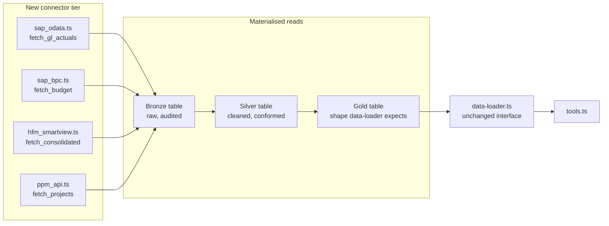
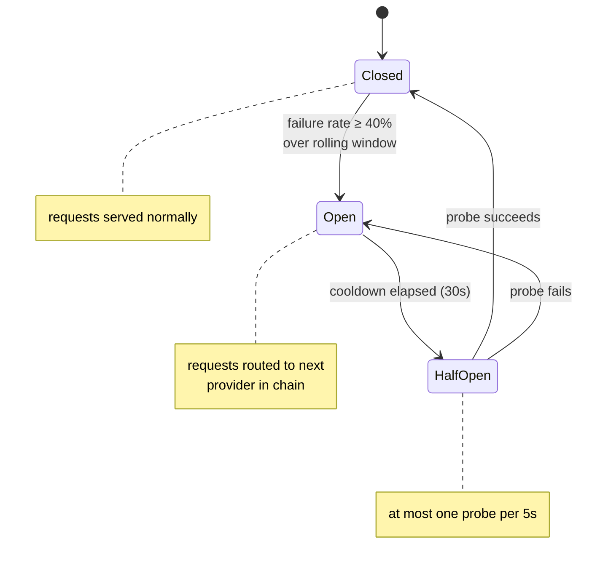
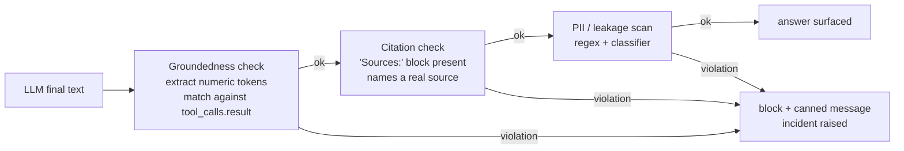
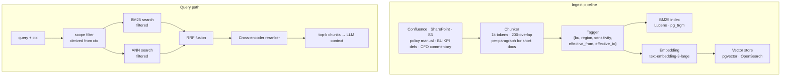
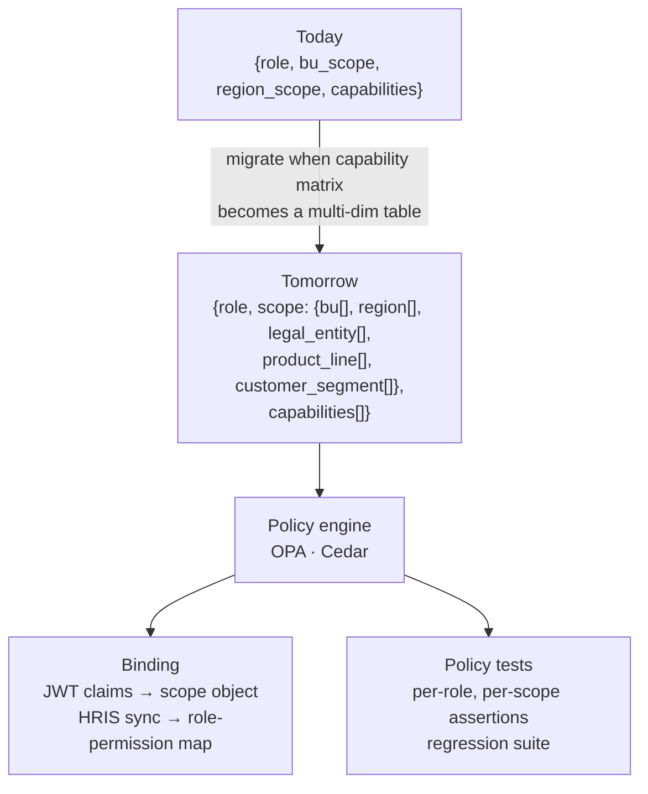
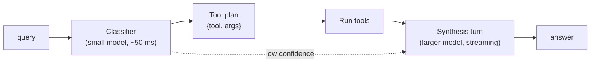
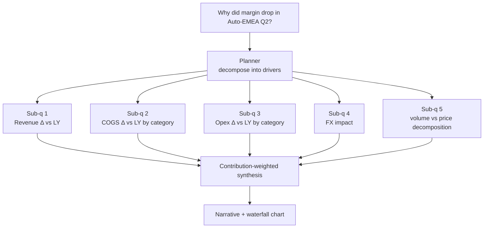

# From Prototype to Production

The prototype validates the architecture against mock data and a single LLM provider. This document lays out the **phased plan** to scale Ask Finance into a production system across a multi-BU conglomerate, with concrete deltas, sequencing, and the engineering work each phase implies. Crucially, it also names what we **deliberately will not build** — the boundary of the system is as much a design artefact as the system itself.

```mermaid
gantt
  title Roadmap — phased rollout
  dateFormat  YYYY-MM
  axisFormat  %Y-%m
  section Phase 0
  Prototype hardened (this build)        :done,    p0, 2026-04, 1M
  section Phase 1 — Pilot
  Real connectors (SAP/HFM/PPM)          :active,  c1, 2026-05, 2M
  Multi-provider failover                :         c2, 2026-05, 1M
  Output guardrails                      :         c3, 2026-06, 1M
  Eval harness wired to CI               :         c4, 2026-05, 1M
  Pilot: 1 BU, 2 roles                   :crit,    c5, after c1, 1M
  section Phase 2 — Scale
  Hybrid retrieval over knowledge        :         s1, 2026-08, 2M
  Dimensional RBAC                       :         s2, 2026-09, 2M
  Streaming + per-tool routing           :         s3, 2026-09, 1M
  Cost guardrails per BU                 :         s4, 2026-10, 1M
  GA: 5 BUs, 4 roles                     :crit,    s5, 2026-11, 2M
  section Phase 3 — Differentiate
  Driver-tree analysis                   :         d1, 2027-01, 2M
  Anomaly explainer                      :         d2, 2027-02, 2M
  Memory + personalisation               :         d3, 2027-03, 2M
```

The dates are illustrative — the gates between phases (see Evaluation: launch criteria) are absolute. A phase ships when its gates clear, not when its sprint ends.

---

## Phase 1 — Pilot readiness

The prototype is one deployment, mock data, one provider. Pilot needs five things the prototype does not have.

### 1.1 Real enterprise connectors

Replace `lib/data/*.csv` with adapters that hit live source systems. The data-layer API stays the same — only the body changes.



| Source | Connector | Refresh | Notes |
|---|---|---|---|
| **SAP S/4HANA** | OData / CDS Views via `pyrfc` or SAP Graph | hourly | OAuth client-credentials; named ranges per company code |
| **SAP BPC** | BPC BW API or AfO landing zone | daily | Budget snapshots versioned by plan cycle |
| **Oracle HFM** | HFM web-services (`hfmws`) or Smart View → S3 | monthly post-close | Mapped through consolidation hierarchy table |
| **Planview / Clarity PPM** | REST API | daily | Project master + monthly actuals |
| **Data lake** | Databricks SQL / Snowflake | on-demand | Unstructured narrative + operational KPIs |

**Adapter contract** — every connector returns the *same* normalised schema the current `data_loader` expects (`{period, fiscal_year, fiscal_quarter, bu, region, account_code, account_name, account_category, amount_usd_mn}`). Schema drift is detected at ingest with a JSON Schema validator; mismatches block the deploy, not the runtime.

**Materialised layer** — connector outputs land in a Delta / Iceberg table. Tools never read raw connector responses. This gives:

- Reproducibility: the same query at the same time always reads the same rows.
- Replay: a bug in a tool can be reproduced against the exact data state when it occurred.
- Decoupling: connector outages do not take down the agent — it serves the last good snapshot with a `Data as of …` banner.

### 1.2 Multi-provider failover

The prototype implements Gemini + mock. Pilot adds Anthropic and OpenAI as secondary / tertiary, with a real circuit breaker.



Engineering deltas:

- `lib/providers/{gemini,anthropic,openai,mock}.ts` — each implements the `LLMProvider` interface from the architecture doc.
- `lib/providers/router.ts` — chain config, circuit breaker, jittered exponential backoff (50 ms base, 2× factor, 1 s ceiling, ±20% jitter).
- Per-provider error classification (`RATE_LIMIT`, `CONTEXT_OVERFLOW`, `BAD_TOOL_ARGS`, `TIMEOUT`, `SAFETY_BLOCKED`, `UNAVAILABLE`) — the orchestrator switches on the typed error, not on stringy provider error messages.
- **Per-provider key pool** (already shipped in this build for Gemini): each provider holds a round-robin pool of API keys with per-key cooldown on 429 / 5xx. Drops the first-line failure mode from "vendor outage" to "single-key revocation," which is far more common in practice. Same `lib/key-pool.ts` is reused by every provider adapter.
- Metrics: `provider_request_total{provider, ok}`, `provider_failover_total{from, to}`, `circuit_state{provider}`, `key_pool_healthy{provider}`, `key_rotation_total{provider, reason}`.

Provider failover is not a "nice to have" — large frontier providers have minutes-to-hours-long outages roughly monthly across the industry, and individual API keys hit quota or get rotated by Security on a much shorter cadence. A finance assistant that goes dark in either window is unfit for purpose.

### 1.3 Output guardrails

The prototype trusts the model to honour the "cite every number" rule. Pilot enforces it at the boundary.



The groundedness check is the cheapest, highest-leverage guardrail in the system. A regex extractor pulls every number from the candidate answer; a structural matcher verifies each appears in the union of `tool_calls[].result`. Cost: a few ms per request. Catches: hallucinated numbers, mistaken aggregations, misread periods. This is the gate that lets a Finance Lead sign off on the system.

### 1.4 Identity wired to SSO

Replace the demo persona switcher with a verified JWT. Group-to-role mapping is sourced from the HR system, not from `users.json`. Two changes that matter:

- **Token revocation propagation.** When HR deactivates a user, the next API call must return 401 within minutes, not at next token expiry. Implement via a small revocation cache invalidated on HRIS webhook.
- **Quarterly access review.** Roles vs. capabilities exported and diffed against HR; deltas reviewed by Finance Control. The same export is the SOC-2 evidence pack.

### 1.5 Eval harness in CI

Wire the regression and red-team suites into GitHub Actions per the Evaluation doc. Pilot does not start without:

- PR check that runs offline regression against mock provider.
- Nightly full suite with live provider, LLM-judge metrics, latency/cost capture.
- Alarms for drop in citation coverage, scope leakage, or groundedness violations.

---

## Phase 2 — Scale

Pilot proves the architecture with one BU. Phase 2 expands to the conglomerate.

### 2.1 Hybrid retrieval over finance knowledge

The hard-coded glossary outgrows itself the moment the second BU is onboarded — KPI definitions diverge ("Bookings" ≠ "Orders" ≠ "Revenue"), the controller's policy manual fills 200 pages, and CFO commentary becomes the primary corpus for "how do we usually talk about Opex?".

Hybrid retrieval (BM25 + dense + cross-encoder reranker) is the right call here for the reasons in the Architecture doc: finance text is heavy in exact-match tokens (account codes, entity codes, fiscal periods) that pure semantic embeddings smear over.



**RBAC at retrieval time** is non-negotiable. Every chunk carries `{bu, region, sensitivity}`; the filter applies *inside* the index, not after — otherwise a determined attacker can probe the index timing to infer existence. A BU GM cannot retrieve another BU's commentary regardless of how the embeddings cluster.

**Sensitivity tiers** add a second filter dimension beyond BU/region:

- `public` — public-facing materials (annual report, press releases). Visible to anyone with `read_actuals`.
- `internal` — internal commentary, working drafts. Visible to all BU staff.
- `restricted` — material non-public information, board decks. Visible only to the originating role chain.

Retrieval evaluation gets its own metrics (Recall@k, NDCG@5) tracked separately from agent metrics — see Evaluation.

### 2.2 Dimensional RBAC

Five roles × two scope dimensions is enough for one BU. A conglomerate of 20 BUs × 10 regions × ~6 legal entities × multiple product lines × customer segments is not.



The migration is dual-running — old `RBACContext` and new `RBACContextV2` coexist via an adapter. New tools accept the V2 shape; old tools see a V1 view. Old shape is retired only after every tool migrates.

OPA / Cedar earn their operational tax once the matrix is multi-dimensional. The argument we made for *not* using a policy engine in the prototype (five rows of a small table fit in code) inverts at this scale.

### 2.3 Streaming + per-tool routing

Two latency wins on the same release:

**Streaming** — the final-text turn becomes Server-Sent Events. The chat UI shows tokens as they arrive instead of a 2-second blank bubble. Tool-use loop semantics remain unchanged; only the synthesis turn streams.

**Per-tool routing** — a fast classifier (Gemini 2.0 Flash-Lite or a local distilled model) picks the tool, leaving the larger model only for synthesis. Halves cost on point questions; for complex driver-tree questions the route still goes to the larger model.



Risk: classifier misroutes. Mitigation: shadow the classifier against the full agent before promoting; alarm on tool-plan disagreement.

### 2.4 Cost guardrails per BU

Each BU gets a monthly token budget. The Provider Router consults a budget service before every request:

- 0–80%: served by primary provider.
- 80–100%: served by secondary (cheaper) provider; budget owner notified.
- > 100%: served by mock planner with a banner; budget owner paged.

The cost dashboard segments by `(BU, provider, intent)`. Deviations from baseline trigger triage — usually they're benign (a CFO ran a heavy quarterly review), occasionally they're a runaway prompt that warrants a fix.

---

## Phase 3 — Differentiate

The above is table stakes. Phase 3 is what makes Ask Finance materially better than the BP it replaces.

### 3.1 Driver-tree analysis

Today's agent does point questions well. It cannot yet answer *"Why did EBIT margin drop in Automotive-EMEA in Q2?"* — that requires a planner that decomposes the question into sub-queries, reasons about contribution analysis, and synthesises a narrative.



This is when a graph framework (LangGraph or its successor) starts to earn its keep. The planner needs persistent state, branching, and revisitation — a flat tool-use loop is the wrong shape.

### 3.2 Anomaly explainer

Nightly job that scans the audit log and the actuals tables for cost-line anomalies (MAD-based outlier detection per BU × account category), generates a draft *"why did this change?"* narrative using the driver-tree pipeline, and drops it in the BP's Teams channel for review.

The agent goes from reactive ("answer the BP's question") to proactive ("flag the question the BP didn't think to ask"). Crucially, the proactive surface is reviewed by a human before reaching leadership — no proactive nudges to executives without a BP in the loop.

### 3.3 Memory and personalisation

Per-user preferences and recurring-query shortcuts. *"Every Monday 9 AM, send me my P&L flash"* becomes a scheduled run. *"My region"* for Priya means APAC.

The constraint that survives every iteration of the design: **memory cannot expand scope.** A memory that encodes "user prefers tables" is fine. A memory that encodes "user has access to Healthcare data" is forbidden — scope is sourced exclusively from the SSO + HRIS flow, never from a memory store.

---

## Risk register

| Risk | Likelihood | Impact | Mitigation |
|---|---|---|---|
| Provider deprecates a model mid-pilot | Medium | High | Multi-provider router from day one; pin model versions; shadow new versions before adoption |
| Connector outage | Medium | High | Materialised reads; "data as of …" banner; mock fallback stays wired |
| Eval set under-covers a new BU | High | Medium | Synthetic minority oversampling; per-stratum gates; new-BU onboarding includes 30-question authored set |
| Cost runaway from a prompt regression | Medium | Medium | Per-BU monthly budget with auto-degrade; cost dashboard alarm |
| Schema drift from source systems | Medium | High | JSON Schema validation at ingest; deploys block on mismatch; tool `enum` arguments tied to live schema |
| Prompt-injection via retrieved chunk | Medium | Critical | Retrieval RBAC filter; source allow-listing; tool-result schema re-validation |
| Loss of judge-model calibration | Medium | Medium | Weekly human-judge sample (50 cases); α monitoring; recalibration trigger at α < 0.7 |
| Vendor lock-in | Low | Medium | Tool schemas in JSON Schema; provider abstraction; routine annual migration drill |
| Insider exfiltration via screenshots | Low | High | Out-of-scope — DLP / endpoint problem; compensating control: audit log shows what every user has seen |
| RBAC misconfiguration in HR sync | Low | High | Quarterly access review; diff alerts; capability tests in CI per role |

---

## Productionisation checklist

A condensed view of what must be true before a phase ships.

### Pilot

- [ ] Real connectors for SAP-ECC actuals + SAP-BPC budget + PPM (HFM optional for pilot).
- [ ] Materialised data layer (Bronze / Silver / Gold) with freshness SLAs.
- [ ] Multi-provider router with circuit breaker; shadow of secondary for 1 week.
- [ ] Output guardrails (groundedness, citation, PII) live and gating.
- [ ] SSO replaces `users.json`; quarterly access review report exists.
- [ ] Eval harness in CI; nightly full suite passes targets for 2 consecutive runs.
- [ ] Audit log shipped to SIEM with retention policy.
- [ ] Per-user rate limit + per-BU monthly token budget.
- [ ] Rollback plan documented; per-BU kill switch tested.
- [ ] On-call rota; runbook published.
- [ ] Disaster scenarios drilled (LLM down, connector down).

### General availability

- [ ] All Pilot items hold for 90 days.
- [ ] Hybrid retrieval over finance knowledge live; retrieval IR metrics in budget.
- [ ] Dimensional RBAC migration complete; old RBAC retired.
- [ ] Streaming + per-tool routing live; latency P95 within target.
- [ ] Quarterly red-team review; no Critical findings.
- [ ] SOC-2 evidence pack accepted by Security.
- [ ] Multilingual prompt support, where business demands it.

---

## Trade-offs we will revisit

- **Function calling vs. structured outputs.** All major providers now support strict JSON-schema outputs. For the *final* response (after tool calls), structured output lets the UI render typed components instead of parsing markdown. Spike before pilot; adopt if it shaves complexity from the UI.
- **Server components for chat.** The chat is a client component today. When the streaming RSC patterns settle, migrate for an instant first paint without sacrificing interactivity.
- **Speculative tool execution.** When the model emits a tool plan, dispatching the obvious next call before the model emits it can shave hundreds of ms. Risk: wasted compute if the plan is revised. Worth measuring once the eval harness gives a baseline.
- **Local LLM for sensitive scopes.** Some BUs may regulate that data never leaves the corporate boundary. A locally-hosted Llama-class or Mistral-class model can serve those tenants. The provider abstraction was designed with this in mind — adding a `vertex_internal` or `ollama_internal` provider is a config change.

---

## What we explicitly will not build

- **Natural-language-to-SQL.** Even sandboxed, it lets the model reach data the tools chose to expose carefully. NL→metric is fine *behind a semantic layer* where every queryable metric has been vetted by Finance Control. NL→SQL against the warehouse is not.
- **Free-text knowledge upload by users.** Tempting for *"let me drop in a deck and ask about it."* Forbidden because user-uploaded content is a prompt-injection vector that bypasses every tool guard. Knowledge ingestion is governed and goes through an approval flow.
- **Proactive nudges to executives.** The system answers when asked, and proposes drafts to BPs. It does not page the CFO at 8 AM with an "interesting observation." Push communication inherits the cost, fairness, and consent considerations of mass communication; out of scope until the answer-when-asked surface is rock solid.
- **Cross-tenant analytics on usage.** Aggregating "what do CFOs typically ask?" across tenants is a research-grade data product with a different governance regime than the assistant itself. If pursued, it lives in a separate system with its own consent model.
- **An "agent that takes actions."** Read-only is the entire surface for v1 and v2. Write paths (post a journal entry, approve a budget) are a different security model and a different liability profile; they belong to a successor product, not this one.

The boundary is the design.
